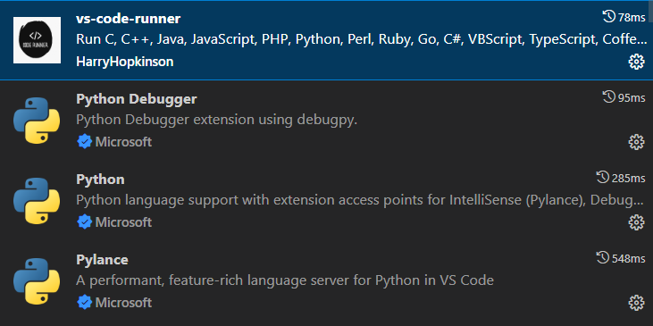
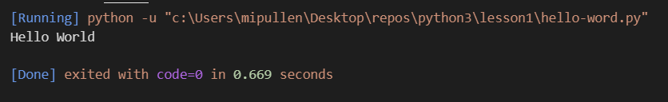

# Python 3 Instructions

## Getting Started

### Download Tools

First thing todo is to download the necessary python and IDE tools that we will use to learn python

* Download Python3 [Python 3.13.3 Download](https://www.python.org/ftp/python/3.13.3/python-3.13.3-amd64.exe)
* Download VSCode [VSCode](https://code.visualstudio.com/download)

*Python interpreter should get added to windows PATH - but if your py files won't execute check there first.*

### Configure Tools

 Install python extensions in vscode which will make running python files easier.

* vs-code-runner - allows for us to run python and other code from the vscode IDE

* python debugger - allows for us to set breakpoints in python code

* python - language support for python in vscode

* pylance - feature rich language support - better autocomplete etc

## Lessons

Each lesson will be in it's own directory within this repository - lessons that require you to write code to complete will have stubbed files - with completed answer files in to help you if you get stuck. Please note that answer files are not the only way to solve a particular coding challenge. If your code doesn't match - it doesn't mean that it's incorrect - it very well may be better than the answer provided.

### Lesson 1 Hello World

Open the Lesson 1 directory - there is a single file with named hello-world.py
The .py extension indicates that this is a python file.

#### Steps

1. Open the hello-world.py file
2. Click Play / Run button above the hello-world.py file content in the command / tab bar.
3. Verify you have "Hello World" text printed out on the command line.

